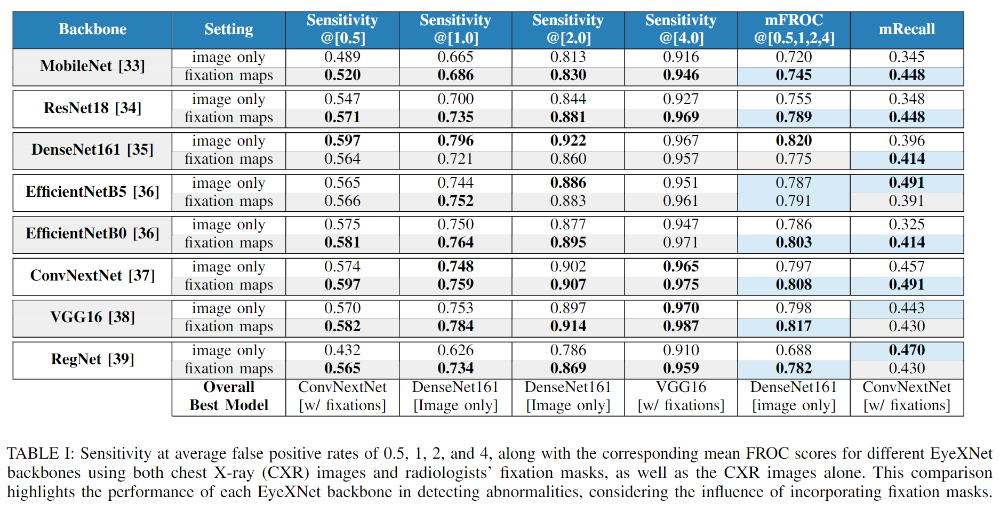
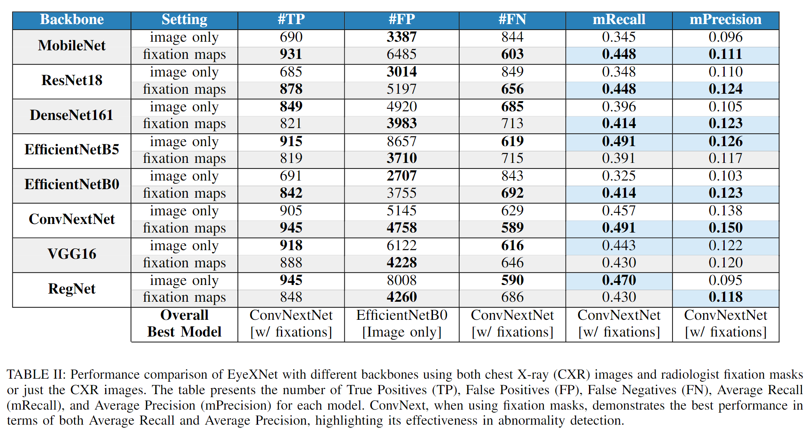

# EyeNet
Our experiments were conducted using Jupyter notebooks to facilitate real-time performance inspection. This README file provides an explanation of the purpose of some important notebooks and guides users on how to reproduce the experiments.

## Preprocessing
In the initial step, we preprocess the CSV file extracted from the MIMIC-Eye dataset in the `[preprocessing] reflacx-eye.ipynb` notebook. The processed file is then saved in ./spreadsheets for further use.

## Training

The training process is performed in the `[train] train.ipynb` notebook. In this script, you will need to set up your hyperparameters in the first few cells. For the hyperparameters used in our EyeNet experiments, please refer to the `[EyeNet][eval] eval_csv_generation.ipynb` notebook, which contains the `ModelSetup` instance for our experiments. During training, the model's performance will be displayed in real-time, allowing for inspection of the training process. This enables us to monitor the model's trainability and identify potential overfitting. At the end of training, the paths to the trained weights will be printed. These weights are usually stored in `./trained_models`. Additionally, the `training_records` folder stores other training-related information, such as running time and performance on each epoch. (Note: If your system throws an error indicating the absence of these folders, you may need to manually create them.)

Since performance during training is recorded, it is possible to check the model's convergence in real-time or after training. If the model has not converged after the specified number of epochs in `[train] train.ipynb`, you can use `[train] continue_training.ipynb` to load the model and optimizer and continue training until your desired epoch.

## Trained Models

Our experiments are controlled by a class called `ModelSetup`, which can be found in `./models/setup.py`. All the parameters can be found in `[EyeNet][eval] eval_csv_generation.ipynb`. In this notebook, a variable named `setup_map` stores all the ModelSetup instances used for different `models/experiments`.

Regarding the trained models, the weights are uploaded to [Google drive](https://drive.google.com/file/d/1raLNLuHRxcWXEHG2eg3x9BmbvKAam3Ai/view?usp=sharing) as they are too large to be included in the GitHub repository. The `[EyeNet][eval] eval_csv_generation.ipynb` notebook provides a function called `get_trained_model_wiith_setup` that demonstrates how to load the weights into the model. To reproduce the evaluation process, you need to download the pre-trained weights from Google Drive and place the uncompressed folder in the root of this workspace. And, the next evaluation section describes two scripts that can be used to generate the evaluation results.

## Evaluations

Above two tables show the performance of models with different backbones. To generate these results, tow notebooks are used:

1. `[EyeNet][eval] eval_csv_generation.ipynb`: Firstly, this script is designed to conduct evaluations for each model based on your specified settings. This notebook will generate a separate CSV file for each model to record its performance.

2. `[EyeNet][eval] eval_csv_read.ipynb`: The second script aims to combine and analyze the generated evaluation CSV files. This particular file serves the purpose of analyzing the results while preserving the integrity of the evaluation process. At the end of this script, the combined results are saved to a CSV file, providing you with an overview of their performance as the tables above.

